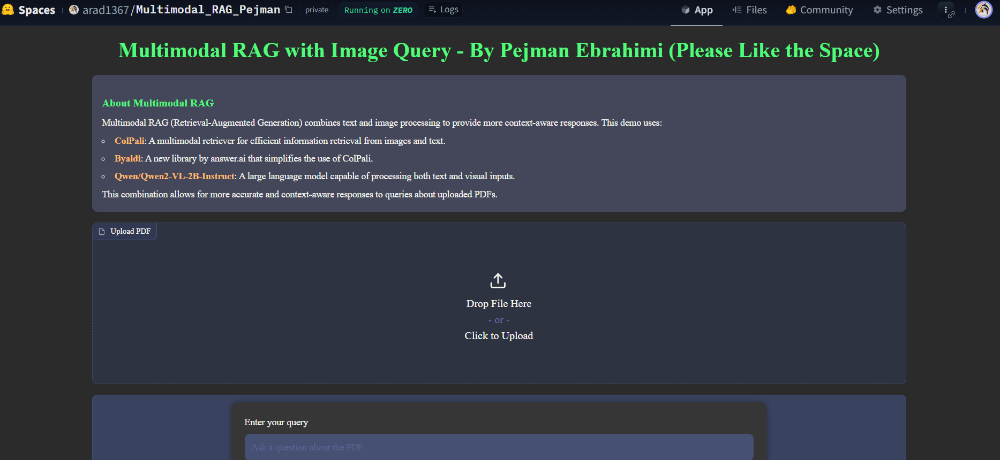

# Multimodal RAG with Image Query - By Pejman Ebrahimi



## Table of Contents
- [Introduction](#introduction)
- [Features](#features)
- [Technologies Used](#technologies-used)
- [Installation](#installation)
- [Usage](#usage)
- [How It Works](#how-it-works)
- [Hugging Face Demo](#hugging-face-demo)
- [Contributing](#contributing)
- [License](#license)
- [Contact](#contact)

## Introduction

This project implements a Multimodal Retrieval-Augmented Generation (RAG) system with image query capabilities. It allows users to upload PDF documents, ask questions about their content, and receive context-aware responses based on both textual and visual information within the document. The project is 100% open source and feel free to use it. You don't need any API key for this project.
* For this Project you need `GPU access` and `enough RAM`.

## Features

- PDF document upload and processing
- Text and image-based querying
- Integration of ColPali for multimodal retrieval
- Use of Qwen2-VL-2B-Instruct for generating responses
- User-friendly interface built with Gradio
- Dark mode UI for comfortable viewing

## Technologies Used

- [Python](https://www.python.org/)
- [Gradio](https://www.gradio.app/) for the web interface (SDK)
- [ColPali](https://github.com/illuin-tech/colpali) for multimodal retrieval
- [Byaldi](https://github.com/AnswerDotAI/byaldi) for simplified use of ColPali
- [Qwen2-VL-2B-Instruct](https://huggingface.co/Qwen/Qwen2-VL-2B-Instruct) for text generation & OCR 
- [pdf2image](https://github.com/Belval/pdf2image) for PDF processing
- [PyTorch](https://pytorch.org/) and [Transformers](https://huggingface.co/transformers/) for deep learning operations

## Installation

1. Clone the repository:
   ```
   git clone https://github.com/yourusername/multimodal-rag-image-query.git
   cd multimodal-rag-image-query
   ```

2. Install the required dependencies:
   ```
   pip install -r requirements.txt
   ```

3. Install Poppler (required for pdf2image):
   - On Ubuntu:
     ```
     sudo apt-get update
     sudo apt-get install -y poppler-utils
     ```
   - On macOS:
     ```
     brew install poppler
     ```
   - On Windows, follow the instructions [here](https://github.com/Belval/pdf2image#windows).

4. Install flash-attn:
   ```
   pip install flash-attn --no-build-isolation
   ```

## Usage

1. Run the application:
   ```
   python app.py
   ```

2. Open your web browser and navigate to the URL displayed by gradio in the console.

3. Upload a PDF document using the file upload button.

4. Enter your query in the text box.

5. Click "Submit" to process your query and receive a response.

6. The application will display the model's answer and the number of images found in the PDF.

## How It Works

1. The user uploads a PDF document, which is converted into images.
2. The ColPali multimodal retriever indexes the document, creating a searchable database of text and image content.
3. When a user submits a query, the system uses RAG to find the most relevant information from the indexed document.
4. The Qwen2-VL-2B-Instruct model processes the retrieved information along with the user's query to generate a context-aware response.
5. The response is displayed to the user through the Gradio interface.

## Hugging Face Demo
* Check the deployed app on Hugging Face [here](https://huggingface.co/spaces/arad1367/Multimodal_RAG_Pejman)

## Contributing

Contributions are welcome! Please feel free to submit a Pull Request.


## License

This project is licensed under the MIT License - see the [LICENSE](LICENSE) file for details.


## Contact

Pejman Ebrahimi
- LinkedIn: [Pejman Ebrahimi](https://www.linkedin.com/in/pejman-ebrahimi-4a60151a7/)
- GitHub: [@arad1367](https://github.com/arad1367)
- Website: [GilTech Megoldások KFT.](https://giltech-megoldasok.com/)

For any questions or feedback, please open an issue in the GitHub repository.